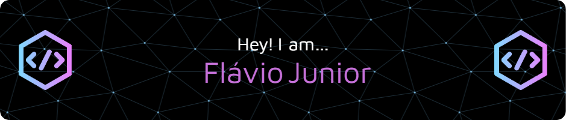

&nbsp;&nbsp;&nbsp; 

Eu 💜 resolver desafios usando tecnologia.    
Olá! Sou um estudante de Engenharia de Software na renomada PUC Minas, onde tenho mergulhado nas complexidades e maravilhas deste campo em constante evolução. Sou impulsionado pela paixão pelo aprendizado e pela constante busca por novos desafios. Como desenvolvedor full stack, estou determinado a adquirir experiência prática no mercado, aproveitando cada oportunidade para ampliar meus conhecimentos e contribuir de forma significativa para projetos inovadores. Com uma mente inquisitiva e ávida por conhecimento, estou pronto para enfrentar os desafios do mundo da tecnologia e crescer profissionalmente.

 
&nbsp;

 

 
 &nbsp;
 &nbsp;

## My Skills

#### Main Stack:

&nbsp;
&nbsp;
&nbsp;
&nbsp;

#### Secondary Stack:
&nbsp;
&nbsp;

#### Studying in this moment:

&nbsp;
&nbsp;

#### Databases:

&nbsp;

#### Workstation Tools:

&nbsp;
&nbsp;
&nbsp;
&nbsp;
&nbsp;

&nbsp;
&nbsp;

## Contacts:

 

 

-----

-----

 Sobre mim:

 
 Me chamo Flávio Junior, e sou estudante de Engenharia de Software na PUC Minas, uma jornada que me levou a explorar profundamente o universo da tecnologia e da programação. Desde 2021, tenho atuado como desenvolvedor full stack, uma trajetória que teve início com a familiarização com as linguagens HTML, CSS e JavaScript. Durante minha jornada acadêmica, mergulhei mais fundo no estudo da linguagem C, o que despertou em mim um entusiasmo genuíno por sua potência e versatilidade.

 Desde o Ensino Médio, descobri que tenho uma habilidade natural para interagir e me comunicar com as pessoas, uma qualidade que se mostrou valiosa em minha carreira e vida pessoal. Além disso, sou um ávido adepto do desenvolvimento pessoal, sempre buscando oportunidades para aprender e crescer. Uma das minhas formas favoritas de absorver conhecimento é através da leitura de livros, uma paixão que me acompanha desde cedo.

 Minha paixão pela tecnologia é algo que carrego comigo desde a infância. Lembro-me vividamente do dia em que ganhei meu primeiro computador, aos 4 anos de idade, um momento que marcou o início de uma jornada fascinante e repleta de descobertas. Minha curiosidade incessante, embora tenha me colocado diante de desafios ao longo do caminho, foi fundamental para meu desenvolvimento pessoal e profissional. Cada obstáculo superado contribuiu para a construção do conhecimento que possuo hoje, moldando-me em quem sou e impulsionando-me em direção aos meus objetivos.

-----

 Flavio's Spotify Data

<!---  -->

 &nbsp; &nbsp;
 

-----
  
  

